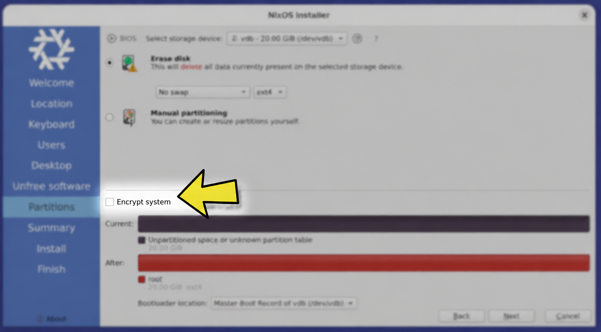

# First time setup - PC NixOS

Guide to fresh install Linux NixOS on computer, with disk encryption and secure boot. This will erase everything existing on PC. Remember, if you have already completed a step you should be able to skip it.

For detailed background, debugging steps, and recovery notes, see the [setup reference](./reference.md).

## 1. [Boot from USB](https://nixos.org/manual/nixos/stable/#sec-installation-booting)
- Turn on PC and enter boot menu.
  - For *HP Firefly G11* and *EliteBook Ultra* this is by pressing *F9* during startup
- Make sure *secure boot* is turned off. If not off:
  1. Turn off then save BIOS
  2. Restart and re-enter boot menu.
    For HP this is by:
    - Pressing esc to enter BIOS menu.
    - Then `Configuration -> Boot Option -> Secure Boot Configuration` and uncheck Secure Boot.
- Select UEFI USB disk in boot menu
- This will open a list of Nix installers to use

> Need to make the USB stick first? See [Booting from USB](./reference.md#booting-from-usb).

## 2. Install nix
- Try default installer first
  - If this fails you can try subsequently down the list
- Follow instructions from installer
  - Unfree: Allow this
  - Partitions: Erase disk. We recommend to `include swap` with `no hibernate`. Enable `Encrypt system` (small check box).
- Reboot when installer is done

> More details: [Installing NixOS](./reference.md#installing-nixos).



*Use this checkbox to enable full disk encryption (LUKS)*

## 3. Run setup
Run
```bash
nix run --extra-experimental-features 'nix-command flakes' github:fornybar/pc#setup
```

This takes us through the following steps. Note, this script exits when manual interaction is requires. Then, perform the necessary actions and re-run the script.

> [!TIP]
> If the setup script fails, you can execute the commands in scripts/setup.sh step-by-step manually for debugging. To avoid having to reinitialize environment variables every time you download a required package and enter a new shell, you can run once:
> ```bash
> nix-shell -p jq git gh sops sbctl age
> ```

### 3.1. Get personal pc repo from GitHub

Follow prompts to authenticate to GitHub and get your personal pc repo into `./personal_pc_repo`. This repo should contain a NixOS configuration that we will apply to the machine.

See [Connecting to the internet](./reference.md#connecting-to-the-internet) if you need network access first.

### 3.2. Update hardware config in personal pc repo

Copy `/etc/nixos/hardware-configuration.nix` into your pc repo and make sure you include the module in your NixOS configuration.

Include luks devices in luks encryption config

```nix
boot.initrd.luks.devices."luks-<luksUUID>" = {
  device = "/dev/disk/by-uuid/<luksUUID>";
};
```

> [!TIP]
> ```bash
> lsblk -f
> sudo cryptsetup isLuks /dev/<device> && echo "LUKS encrypted"
> sudo cryptsetup luksUUID "/dev/<device>" # Eg. nvme0n1p<N>
> ```
> If you forgot to enable encryption in the installer, we recommended to reinstall nixos and enable it through the installer for simplicity instead of partitioning and encrypting your devices manually.

### 3.3. Set up sops age key

Create new sops age key with

```bash
nix-shell -p age
sudo mkdir -p /root/.config/sops/age
sudo age-keygen -o /root/.config/sops/age/keys.txt
```

Then in `./personal_pc_repo`

1. Fill out `.sops.yaml` with the public key part from `/root/.config/sops/age/keys.txt`.
2. Enter shell with sops `nix-shell -p sops`
3. Run `sudo sops secrets.yaml`.
4. Delete all lines.
5. Fill out values according to the templates in this repo: [secrets.tmp.yaml](/templates/hardware/secrets.tmp.yaml):
   - github-token: generate a fine-grained token. Select `All repositories` and add `actions` (R&W), `administration` (R), `contents` (R&W), `issues` (R&W), `pull request` (R&W) and `workflows` (R&W). You can modify the token later. Set fornybar organization as the owner. Remember to authorize fornybar organization.
   - password: run `mkpasswd -m sha-512 <passord>` and pass result
   - nixbuild-ssh: "" (leave empty)

> Reusing an existing key or reading the public key: see [Setting up the sops age key](./reference.md#setting-up-the-sops-age-key).

> [!TIP]
> `<root_github_token>` and `<user_github_token>` in secrets.yaml can use the same fine-grained token.

### 3.4. NixOS rebuild boot

Enter the name of your NixOS configuration in your personal pc repo, then the setup script will build your NixOS machine which will be used after reboot.

Then, reboot.

### 3.5. Configure Secure Boot keys

After new `sbctl` keys have been created and the NixOS configuration is built, which means lanzaboote has signed the boot files, we must enroll the new `sbctl` keys.

> **Prerequisite:** This only works if your personal config enables Secure Boot via lanzaboote (`midgard.pc.security.secureboot.enable = true;`). If you enable Secure Boot in firmware without it, the unsigned bootloader will not boot.

> Background, verification (`bootctl`/`sbctl verify`), and recovery if the machine won't boot: see [Secure Boot with lanzaboote](./reference.md#secure-boot-with-lanzaboote).

Enter Setup Mode by
1. Reboot into BIOS menu
2. Make sure **Sure Start Key Protection** is disabled
3. Go to **Security → Secure Boot Configuration** and **Clear Secure Boot Keys**
4. Continue boot into Setup mode

Then enroll the new keys
```bash
sudo sbctl enroll-keys --microsoft --firmware-builtins
```

Now re-enable Secure Boot by

1. Reboot into menu
2. Go to **Security → Secure Boot Configuration** and enable **Secure Boot**
3. Enable **Sure Start Key Protection**
4. Continue boot
